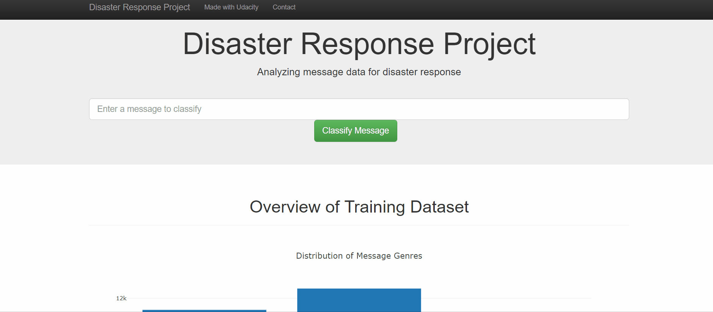
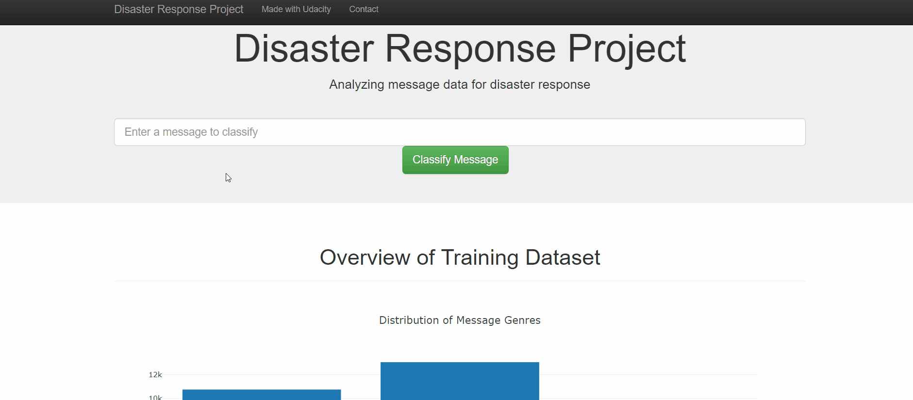

# Disaster Response Pipeline Project

### Project Description:

Goal : Analyze disaster data from Figure Eight to build a model for an API that classifies disaster messages.

The dataset used contains real messages that were sent during disaster events. The machine learning pipeline to categorize these events so that you can send the messages to an appropriate disaster relief agency.

The project includes a web app where an emergency worker can input a new message and get classification results in several categories. The web app also display visualizations of the data. 

Below are a few screenshots of the web app.

### App vizualisations
1. Graphs on the app main page

2. Classification of a new message based on the ML algorithm

### Main files :

1. ETL Pipeline
process_data.py, write a data cleaning pipeline that:
- Loads the messages and categories datasets
- Merges the two datasets
- Cleans the data
- Stores it in a SQLite database
2. ML Pipeline
train_classifier.py, write a machine learning pipeline that:
- Loads data from the SQLite database
- Splits the dataset into training and test sets
- Builds a text processing and machine learning pipeline
- Trains and tunes a model using GridSearchCV
- Outputs results on the test set
- Exports the final model as a pickle file
3. Flask Web App
run.py, write a flask web app that:
- Provide visualizations of the dataset
- Allow to test the classification of new messages based on the ML algorithm trained in the ML Pipeline

### Instructions:
1. Run the following commands in the project's root directory to set up your database and model.

    - To run ETL pipeline that cleans data and stores in database
        `python data/process_data.py data/disaster_messages.csv data/disaster_categories.csv data/DisasterResponse.db`
    - To run ML pipeline that trains classifier and saves
        `python models/train_classifier.py data/DisasterResponse.db models/classifier.pkl`

2. Run the following command in the app's directory to run your web app.
    `python run.py`

3. Go to http://0.0.0.0:3001/
